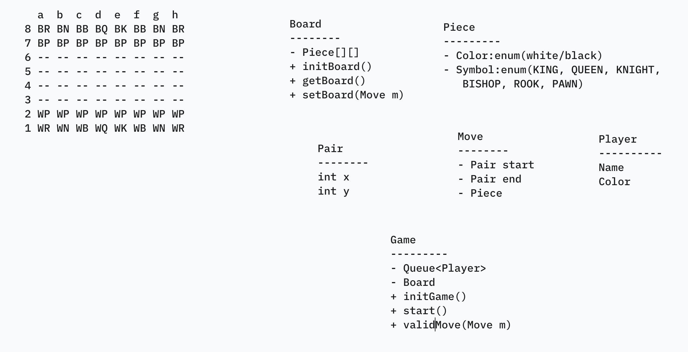

# Chess Game (Manual with validations)

### Rules of the game
- The game is played between two players. One player controls an army of white pieces and the other controls the army of black pieces.
- Each army includes the following pieces: 1 King, 1 Queen, 2 Knights, 2 Rooks, 2 Bishops, 8 Pawns
- Each piece has its own way of moving on the board.
- A player may move only to an empty cell unless it is trying to capture a piece of the other player.
- A piece is captured when a player moves to a position currently occupied by a piece of the opponent.
- Each player needs to move a piece in each turn.
- The game starts with the player owning the white pieces making the first move. After this, the players play alternate turns.
- There are more rules but it is outside the scope of this problem.

#### Pawn
- A pawn can move to a cell which is one step immediately in front of it.
- If it is the first move of that pawn, it can move two positions to a cell in front. Both the cells in front of it needs to be unoccupied.
- It can also move one step diagonally in front while capturing a piece of the opponent. The capture cannot happen without moving diagonally

#### Knight
- A knight moves in an 'L' shape, i.e., two steps horizontally and one step vertically or two steps vertically and one step horizontally.
- The knight can leap over other pieces to land directly on the destination cell.

#### Rook
- A rook can move any number of steps either horizontally or vertically without leaping over any other piece.

#### Bishop
- A bishop can move any number of steps diagonally without leaping over any other piece.

#### Queen
- A queen can move any number of steps in any direction (horizontally, vertically, or diagonally) without leaping over any other piece.

#### King
- A king can move one step in any direction (horizontally, vertically, or diagonally).

## Requirements
Create a command-line application for a chess validator with the following requirements:

- Initialize a chessboard with two players and all the pieces in the right positions.
- Print the board after initializing.
- Allow the user to make moves on behalf of both the players.
- The user will make a move by entering the start position and the end position.
- You need to determine the piece and make the move if it is valid.
- Valid move:
    * The piece is controlled by the player having the current turn
    * The move is valid based on how that particular piece can move
    * The start and end position are inside the board
    * If the move is invalid
    * print 'Invalid Move'
    * the same player plays again
    * If the move is valid:
      - move the piece to the destination and remove any captured piece
- print the board after the move