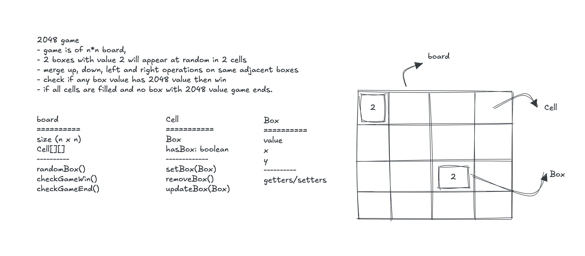

# 2048 Game Design

### Game
- Although since this is numbers games, separate Cell and Box class are not exactly required.
- Game class and Board class is enough.
- left, right, up and down merge is handled.
- At random a '2' is placed on empty boxes for game to continue.
- Game is scalable i.e., size is not fixed to 4x4 board.

### Todo: 
* checkGameEnd() is not implemented.
* Game can be optimised a little.